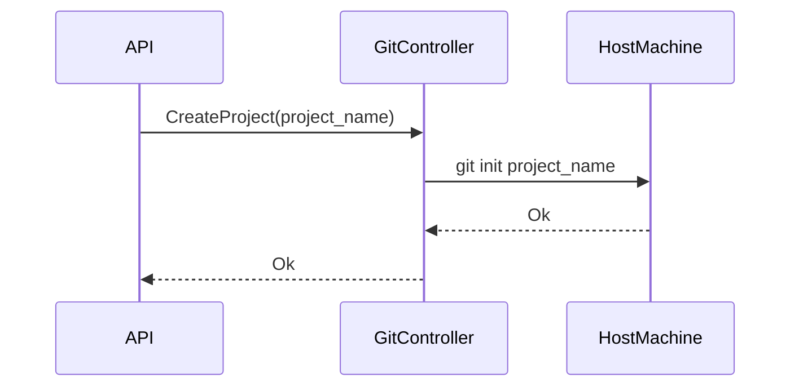
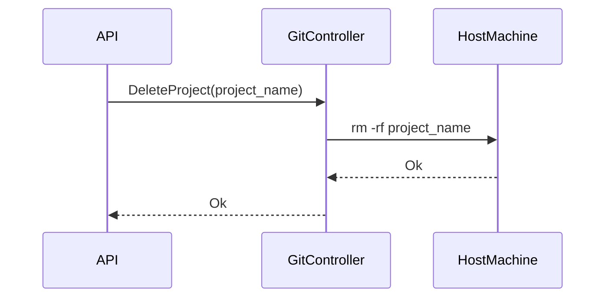

# PaaSTech - Technical Architecture Document

## Contextualisation

### Description and intent

***TODO: [UNIFIED WORK] write description of the software and its intent (what market needs it answers to)***

### Technologies

***TODO: [UNIFIED WORK] define the different technologies below, why they were chosen, and use arguments AND PROOFS to show research***

#### Web application

***TODO: [CLIENT] fill for web application frontend***

#### CLI (Command-Line Interface)

***TODO: [CLIENT] fill for the cli***

#### Client API

***TODO: [CLIENT] fill for the external API***

#### Git controller

***TODO: [GIT] fill for the git controller and architecture***

#### Client applications deployment

***TODO: [INFRA] fill for the architecture used to deploy clients' applications***

#### Database

***TODO: [CLIENT] fill for the unified database schema***

#### CI/CD

***TODO: [UNIFIED WORK] describe use of Github Actions as means of CI/CD***


## Architecture

### Definitions

- the Service refers to PaaSTech as a whole;
- a Client is a user account created by an end user against the Service;
- a Project is a materialisation of a Git repository, created by a Client using either the web frontend or the CLI. A Project can be deployed by the Client by pushing its code to the Service.
- an Application (also referred to as Deployment) is an atomic unit of code, and is the result of a Project deployment. This unit is internally managed and can only be configured to a certain extent by the Client.


### Component interaction

***TODO: [UNIFIED WORK] mermaid diagram of how components interact with eachother***

### Database architecture

***TODO: [CLIENT] describe the database architecture, as referenced in the MCD in the README***

### Detailed specification

#### Key constraints

***TODO: [CLIENT, INFRA] the key constraints that should never be broken by the application (or at least the external parts, like the API and container exposition) in order to maintain security, isolation and client data safety***

#### Client sign-up and login process

***TODO: [CLIENT] mermaid diagram and description of the login process flow, for both the CLI and the web frontend***

#### Projects storage

As all PaaS providers, PaaSTech needs to store the code of the projects created by its Clients. This is done using a [Git](https://git-scm.com/) repository, which is created upon Project creation. The repository is then exposed to the Client, who can push their code to it.

We chose to use Git to store the code of the projects, because it is the most used version control system, and is the most adapted to store code. Using it makes the integration seamless for users who are probably already using Git.

##### Creating and deleting repositories

When a Client initializes a new Project, a new Git repository has to be created; it also has to be deleted when the Project itself is deleted.

The repository is created using the [`git init`](https://git-scm.com/docs/git-init) command. The repository is then stored in a directory, on the host machine, which is named after the **Project's id**.

For now, it is not scalable, as the git repositories are stored on the host machine. In future versions, the storage could be moved to a dedicated storage server or a distributed storage system.

In that sense, to prepare for future versions, the git controller is a **separated component** from the API which could have done the same and is also designed to be **stateless**. It does not store any information about the repositories and only uses the **Project's id** to name the repository's directory. This way, the git controller can be scaled horizontally, and, if needed, the repositories can be stored on a dedicated storage server after adding a layer of authorization.

Since the git controller is separated from the other components, it needs a way to communicate with the API. This was achieved using [gRPC](https://grpc.io/), which is a high performance RPC framework. It is used to create an interface other services can consume. The git controller can then receive commands from the rest of the services and execute shell commands to delete directories and git commands to initialize repositories.

We made the choice to use gRPC instead of a REST API. Indeed, since it uses [Protocol Buffers](https://developers.google.com/protocol-buffers), it is easier to maintain and to evolve as the application grows. It is also more performant than a REST API, and is easier to use, since it is strongly typed. It also limits communication problems between teams and services, since the communication is well-defined and documented through the Protocol Buffer file.

The Git Controller was made in Rust for its high performance, reliability, robustness and memory safety using the [tonic](https://github.com/hyperium/tonic) framework, which is a Rust implementation of gRPC. It was chosen because it is the most used gRPC framework in Rust, and is well documented.

Here's an overview of the interactions of the git controller:

1. Creation of a repository



2. Deletion of a repository



##### Authentication

Once the repositories are stored, the clients need to be able to push to them.

In order to let the users push to the repositories they created, we need to give them access to the host machine. An easy solution would be to give them an SSH access to the host machine with servers like [sshd](https://www.openssh.com/). However, this would give them access to the whole host machine, which is not what we want. Indeed, we want to limit the access of the clients to their own repositories, and not to the whole host machine.

One solution would be to use a git server like [Gitea](https://gitea.io/en-us/) or [GitLab](https://about.gitlab.com/), which provide a full-fledged git service, with authentication and authorization. However, this would require to maintain a full git server, with possibly duplicated data, which is not the goal of PaaSTech.

The option we chose is to create a custom git server, which handles the authentication and authorization of the clients, and then execute only the command `git-receive-pack` which is used to push to a repository. This way, the clients can only push to their own repositories, and not to the whole host machine.

The advantage of this solution is that it is lightweight and gives us full control over the authentication and authorization of the clients.

It also allows us to use the same authentication and authorization system as the rest of the Service, which is easier to maintain.

The git server is written in Golang, for its simplicity and its performance. It is also well documented, and has a lot of libraries to help us build the server, unlike Rust which was the original choice. The libraries used are [ssh made by Gliderlabs](https://github.com/gliderlabs/ssh) which is used to create git clients and servers. It is also used by [Gitea](https://about.gitea.com) to create their git server.

The authentication and authorization process is the following:

1. The client connects to the git server using SSH via `git push`
2. The git server checks if the client is authenticated using the SSH key provided by the client by matching it against the SSH keys stored in the database.
   1. If the client is not authenticated, the connection is closed
3. The git server checks if the client is authorized to push to the repository by checking if the client is the owner of the repository.
   1. If the client is not authorized, the connection is closed
4. The git server executes the command `git-receive-pack` which is used to push to a repository.

```mermaid
sequenceDiagram
    participant GitServer
    participant Database
    participant HostMachine

    Client->>GitServer: git-send-pack repository_name (git push)
    GitServer->>Database: Is the SSH key in the database?
    Database-->>GitServer: result
        GitServer->>Database: Is the SSH key linked to the repository ?
        Database-->>GitServer: result
        alt Authorized
            GitServer->>HostMachine: Execute git-receive-pack
            HostMachine-->>GitServer: Push Successful (from host)
            GitServer-->>Client: Push Successful (continue)
        else Not Authorized
            GitServer-->>Client: Connection Closed (Not Authorized)
        end
    else Not Authenticated
    end
```

##### Building images

Once the code is finally pushed to the repository, it needs to be built in order to be deployed. Since the strategy we have chosen is [Docker](https://www.docker.com/), the code needs to be built into a docker image.

In that essence, since the client code can be written in any language, we need to be able to build the code in any language. To do so, we use [buildpacks](https://buildpacks.io/), which is a tool to build code in any language into a docker image. It is used by [Heroku](https://www.heroku.com/) to build their applications.

How can we trigger the build of the image? For a first version, we chose to use [git hooks](https://git-scm.com/book/en/v2/Customizing-Git-Git-Hooks) to trigger a bash script which will build the image on the host machine.

This is not scalable, as the build is done on the host machine.

It also poses questions about security risks since our SSH server needs to be able to access the docker daemon on the host machine. But it is a good first step to test the concept.

Some builders might not be able to build the code without configuration, hence, we need to be able to configure the buildpacks. To do so, the client can store a file called `buildpacks.yaml` in the `paastech` directory which will allow the user to configure the buildpacks. The file is a yaml file, which contains the configuration of the buildpacks. It is then used by the git hook to configure buildpacks. Here's the structure of the file:

```yaml
buildpacks:
  path: "."
  builder: "paketobuildpacks/builder:full"
  buildpack: "paketo-buildpacks/web-servers"
  env:
    - "BP_WEB_SERVER=nginx"
    - "BP_WEB_SERVER_ROOT=dist"
```

- `path` is the path to the directory containing the code to build
- `builder` is the builder to use to build the code
- `buildpack` is the buildpack to use to build the code
- `env` is the environment variables to pass to the buildpack

The buildpacks are then configured using the `pack` cli, which is the cli of buildpacks. The script is made in bash for its simplicity and its portability. It is also well documented, and has a lot of libraries to help us build the script.

#### Client Applications

***TODO: [INFRA] how are the Client applications provisioned, how they are exposed and how the underlying infrastructure is managed***

## Post-mortem

### Organisational overview

***TODO: [UNIFIED WORK] from an organisation standpoint, how was the entire team organised, how did the squads interact***
