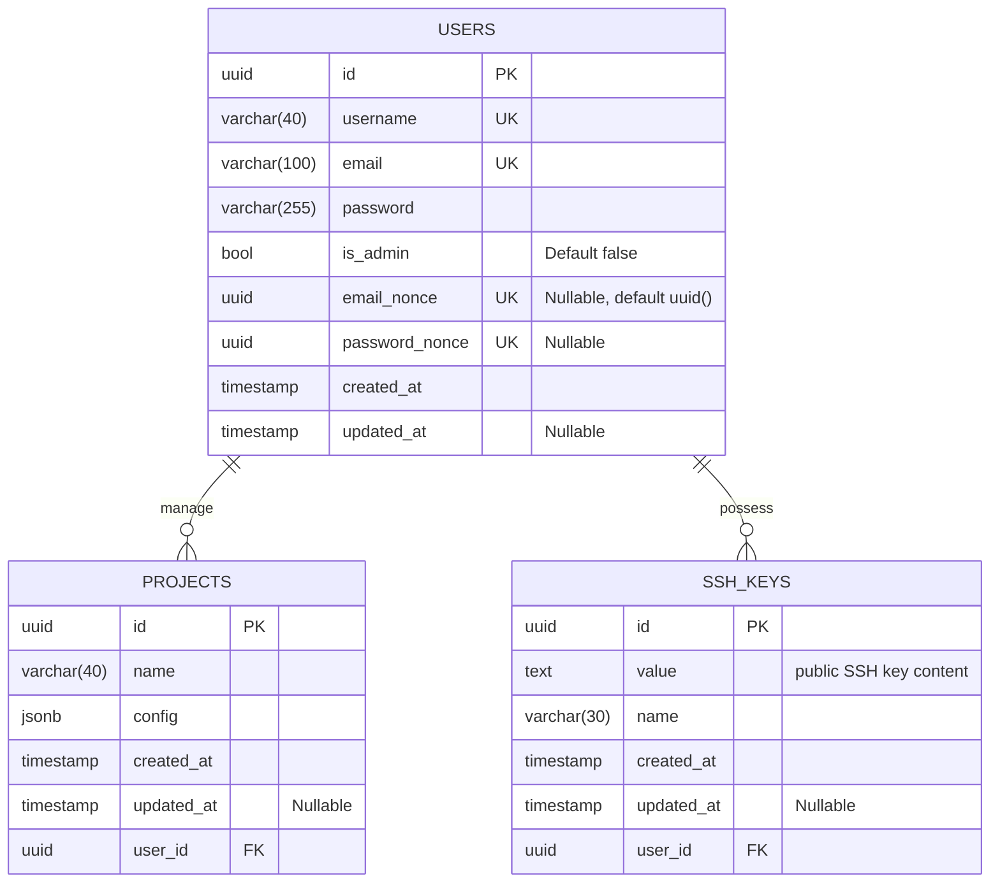
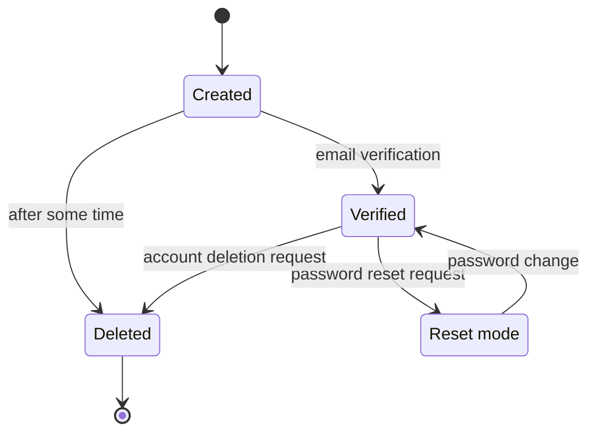

# PaaSTech - Technical Architecture Document

## Contextualisation

### Description and intent

**_TODO: [UNIFIED WORK] write description of the software and its intent (what market needs it answers to)_**

### Technologies

Below are the technologies used for the different components of the application. We will discuss the choices that we made, and why the chosen technology fits in the ecosystem.

A list of TPMs (Third-Party Modules) might be written to give more insight about the component, but please keep in mind those lists are non-exhaustive and only the main TPMs are described.

**_TODO: [UNIFIED WORK] define the different technologies below, why they were chosen, and use arguments AND PROOFS to show research_**

#### Web application

**_TODO: [CLIENT] fill for web application frontend_**

#### CLI (Command-Line Interface)

**_TODO: [CLIENT] fill for the cli_**

#### Client API

The Client API, meaning the external API that Clients connect to and interact with, is made using [NestJS](https://nestjs.com/).
Being a cutting-edge framework gaining more and more attention, NestJS is very versatile and stands
out from the competition by proposing two things:
first of all, a [list of support modules](https://www.npmjs.com/search?q=%40nestjs), which totals to 41 as of today;
then, an [extensive documentation with code examples](https://docs.nestjs.com/) ranging from basics to difficult recipes to setup.

NestJS' support modules provide a substantial support for the integration of well-known modules into the application. The main TPMs used for the API are:

- `class-validator`: validation of DTOs (Data Transfer Objects) and their properties before they are handed out to NestJS controllers
- `@nestjs/config`: ease of access to a config service, centralising both environment variables and `.env` files
- `passport` and `passport-jwt` (along with `@nestjs/passport` and `@nestjs/jwt`): layer of abstraction to handle different authentication methods, such as JWTs, OAuth2 or OIDC. Here, only the JWTs are used.
- `uuid`: generation of UUIDs v4, following [RFC 4122](https://www.rfc-editor.org/rfc/rfc4122)
- `nodemailer` with `handlebars`: sending of outbound emails through SMTP, with templating of HTML emails sent

Moreover, all of the support that NestJS provides doesn't make it slower. Benchmarks open-sourced in v7.6.13 ([available here](https://github.com/nestjs/nest/blob/e7fa96022e8b8580413490101683aabe387ca9b9/benchmarks/all_output.txt)) gave the following comparison:

- NestJS-express is nearly on par with Express for the average response time (`65.44 ms` versus `61.88 ms`)
- NestJS-express is twice as fast in maximum response time (only `325 ms` against Express' `747 ms`)
- NestJS-express can handle nearly twice as many requests concurrently, for the minimum amount doable (`14183 req/s` versus `8407 req/s`)
- NestJS-express is on par with Express for the number of requests handled concurrently, for the average amount doable (`15640` versus `16454.41`)

The API is currently running on NestJS-express v10.0.3, which just released. Two years have passed since the last benchmarks, and we can expect NestJS to be even faster as of now.

##### Authentication strategies

Regarding the authentication strategy, our team decided to create a `GET /auth/login` endpoint which returns a both an JWT HttpOnly cookie as well as a Bearer token. The cookies keep the user safe from XSS (Cross-Site Scripting) while the Bearer token allows users to log in via the CLI.

##### Mail

With sending and receiving emails being an important part of this application for the user, we needed a local way to test these functions without actually needing to connect it to a private email every time. After some search we came across [mailhog](https://github.com/mailhog/MailHog). Mailhog allows anyone to create a temporary local smtp server and send and receive emails through it. Even though you are not able to send emails to real email adresses, you can send and receive local emails, which allowed us to test our code.

##### GRPC

To communicate with the other services, especially pomegranate and the git-repo-manager, we used [grpc](https://grpc.io/), due to its fast performance and low latency. It also allows us to easily create nest clients for the other services, which we can use to communicate with them. Another great advantages of grpc is that it is language agnostic, which means that we can use it to communicate with services written in other languages. Creating the proto files allowed us to define contracts between the services, which made it easier to develop the services independently.

#### Git controller

**_TODO: [GIT] fill for the git controller and architecture_**

#### Client applications deployment

**_TODO: [INFRA] fill for the architecture used to deploy clients' applications_**

#### Database

The chosen database for this application is [PostgreSQL](https://www.postgresql.org/). As market leader, PostgreSQL stands out for its performance and widespread use throughout the world.

The API connects to the database using an ORM called [Prisma](https://www.prisma.io/).

#### CI/CD

**_TODO: [UNIFIED WORK] describe use of Github Actions as means of CI/CD_**

## Architecture

### Definitions

- the Service refers to PaaSTech as a whole;
- a Client (also referred to as a User) is a user account created by an end user against the Service;
- a Project is a materialisation of a Git repository, created by a Client using either the web frontend or the CLI. A Project can be deployed by the Client by pushing its code to the Service.
- an Application (also referred to as Deployment) is an atomic unit of code, and is the result of a Project deployment. This unit is internally managed and can only be configured to a certain extent by the Client.

### Component interaction

**_TODO: [UNIFIED WORK] mermaid diagram of how components interact with eachother_**

### Database architecture

As the database is unified and serves as a focal point of the application, everything is contained in the same logical database.
The architecture is as follows:

### Detailed specification

As you can notice, every table has a uuid field as a primary key. Compared to `SERIAL` that is often used to identify a table, a uuid guarantees a better uniqueness across the database. A [Serial](https://www.postgresql.org/docs/current/datatype-numeric.html) may take up less space (4 bytes) than an [uuid](https://www.postgresql.org/docs/current/datatype-uuid.html) (16 bytes) but since it is a series of incrementing integers it offers information about the time of creation and makes it easier to guess the id whereas an uuid is generated randomly and nearly impossible to duplicate.

Furthermore, since the projects will be deployed at a subdomain that is named after `https://{projectId}.user-app.paastech.cloud` we needed to hide the internal database structure that emerges with a serial id. Therefore, using a uuid prevents sharing sensitive data with everyone and prevents targeted attacks that will use.

The table `users` contains all the necessary information about each user. Upon user creation, an email_nonce is automatically created and a user account is only considered active once the email has been confirmed and the field email_nonce is null.
Should the user wish to reset his password, the field password_nounce will contain a unique uuid allowing the user to reset his password.
One user can have multiple projects or ssh keys.

The `ssh_keys` specified by each user allow them to push their repository onto our git server. Each ssh key can have a name to make it easier to distinguish multiple keys, however, it is not required.
A ssh key belongs to a user, so it will have the same permissions as the user on all his repositories at the moment.

The `projects` table describes a project. Its field `config` contains all the environmental variables of the user, like database authentication. since the configuration and necessary variables change for every project we decided to store it as a flexible json field. We decided to use a jsonb field that stores the json data in binary form, allowing for better performances than a simple json field.

#### Key constraints

**_TODO: [CLIENT, INFRA] the key constraints that should never be broken by the application (or at least the external parts, like the API and container exposition) in order to maintain security, isolation and client data safety_**

#### Client sign-up and login process

##### Client states

When signing up, the client should provide an email, a username and a password. They can then log into the software as soon as they verify their email. If needed, they can request a password reset using the "forgotten password" process. The account should be either deleted or locked/deactivated after some time of an account being active without a verified email, although this is not implemented for now.

##### Flow processes

#### Projects storage

**_TODO: [GIT] how are the projects stored and how is authentication handled upon push_**

#### Client Applications

**_TODO: [INFRA] how are the Client applications provisioned, how they are exposed and how the underlying infrastructure is managed_**

## Post-mortem

### Organisational overview

**_TODO: [UNIFIED WORK] from an organisation standpoint, how was the entire team organised, how did the squads interact_**
