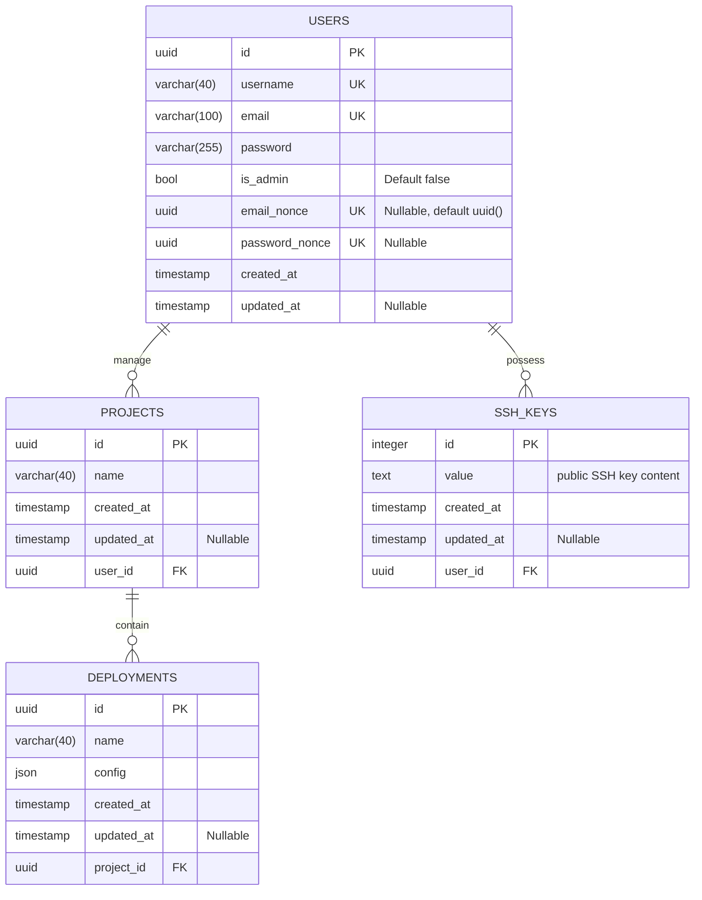

# PaaSTech - Technical Architecture Document

## Contextualisation

### Description and intent

***TODO: [UNIFIED WORK] write description of the software and its intent (what market needs it answers to)***

### Technologies

***TODO: [UNIFIED WORK] define the different technologies below, why they were chosen, and use arguments AND PROOFS to show research***

#### Web application

***TODO: [CLIENT] fill for web application frontend***

#### CLI (Command-Line Interface)

***TODO: [CLIENT] fill for the cli***

#### Client API

***TODO: [CLIENT] fill for the external API***

#### Git controller

***TODO: [GIT] fill for the git controller and architecture***

#### Client applications deployment

***TODO: [INFRA] fill for the architecture used to deploy clients' applications***

#### Database

***TODO: [CLIENT] fill for the unified database schema***

#### CI/CD

***TODO: [UNIFIED WORK] describe use of Github Actions as means of CI/CD***

## Architecture

### Definitions

- the Service refers to PaaSTech as a whole;
- a Client is a user account created by an end user against the Service;
- a Project is a materialisation of a Git repository, created by a Client using either the web frontend or the CLI. A Project can be deployed by the Client by pushing its code to the Service.
- an Application (also referred to as Deployment) is an atomic unit of code, and is the result of a Project deployment. This unit is internally managed and can only be configured to a certain extent by the Client.

### Component interaction

***TODO: [UNIFIED WORK] mermaid diagram of how components interact with eachother***

### Database architecture

As the database is unified and serves as a focal point of the application, everything is contained in the same logical database.
The architecture is as follows:

### Detailed specification

#### Key constraints

***TODO: [CLIENT, INFRA] the key constraints that should never be broken by the application (or at least the external parts, like the API and container exposition) in order to maintain security, isolation and client data safety***

#### Client sign-up and login process

***TODO: [CLIENT] mermaid diagram and description of the login process flow, for both the CLI and the web frontend***

#### Projects storage

***TODO: [GIT] how are the projects stored and how is authentication handled upon push***

#### Client Applications

***TODO: [INFRA] how are the Client applications provisioned, how they are exposed and how the underlying infrastructure is managed***

## Post-mortem

### Organisational overview

***TODO: [UNIFIED WORK] from an organisation standpoint, how was the entire team organised, how did the squads interact***
