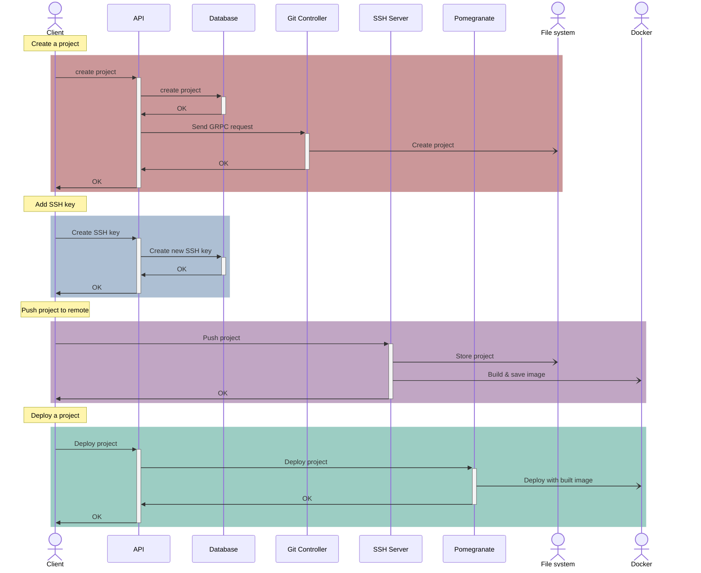
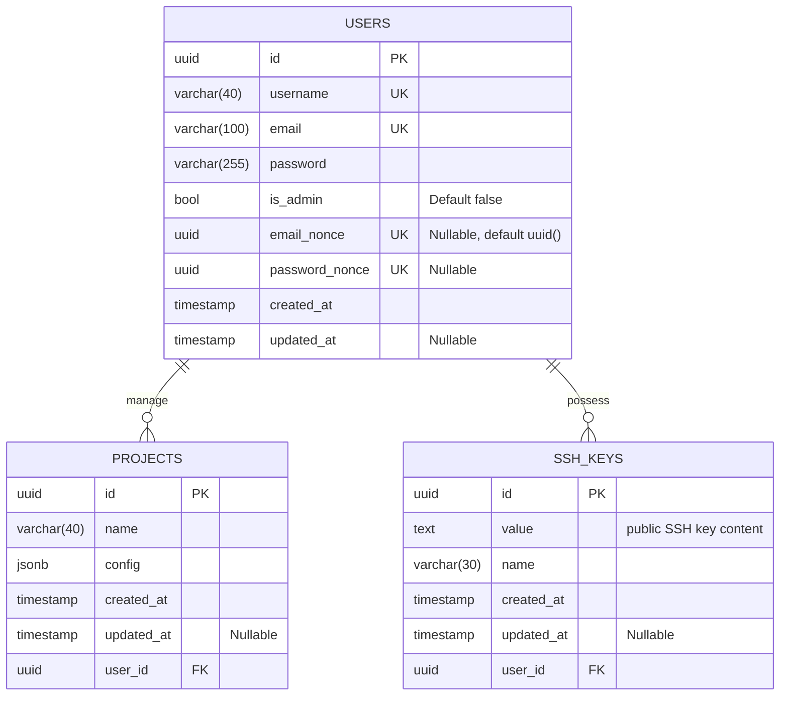
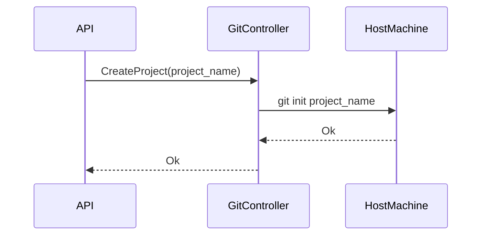
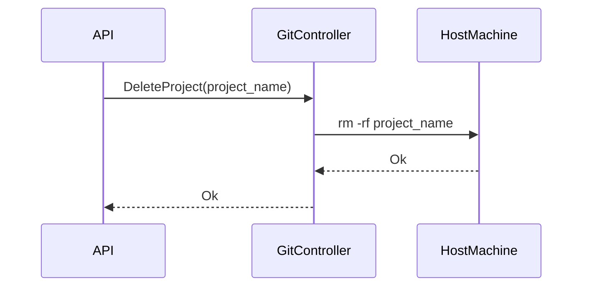
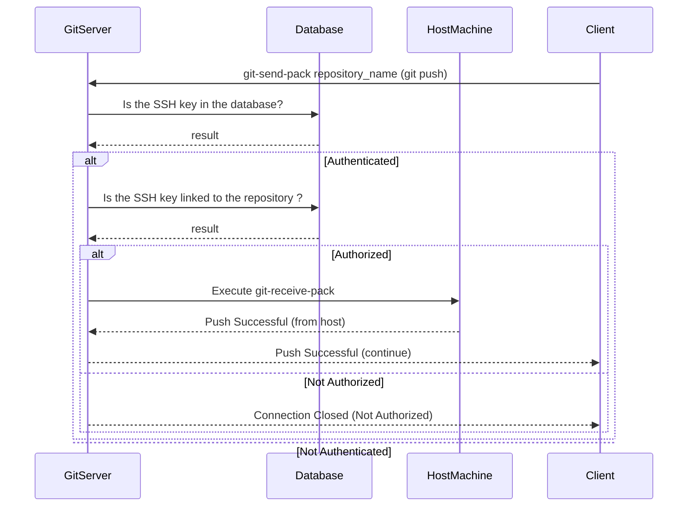
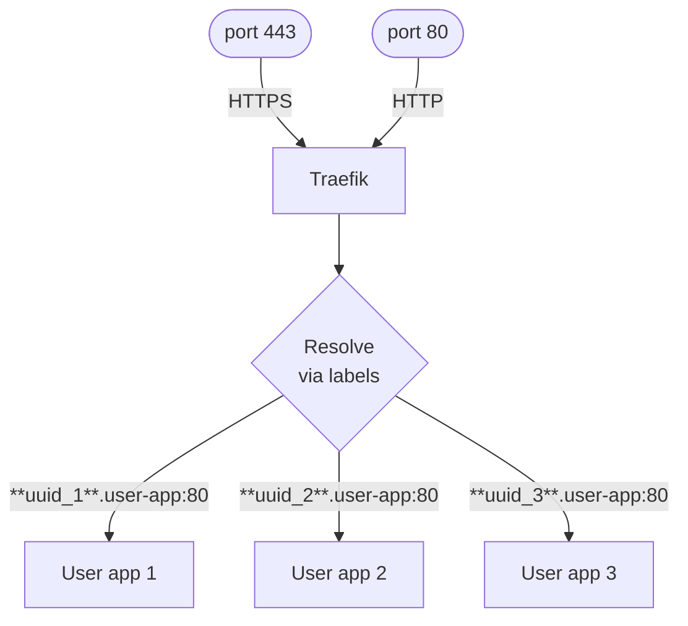

# PaaSTech - Technical Architecture Document

## Contextualisation

### Description and intent

**_TODO: [UNIFIED WORK] write description of the software and its intent (what market needs it answers to)_**

### Technologies

**_TODO: [UNIFIED WORK] define the different technologies below, why they were chosen, and use arguments AND PROOFS to show research_**

#### Web application

**_TODO: [CLIENT] fill for web application frontend_**

#### CLI (Command-Line Interface)

**_TODO: [CLIENT] fill for the cli_**

#### Client API

**_TODO: [CLIENT] fill for the external API_**

#### Git controller

**_TODO: [GIT] fill for the git controller and architecture_**

#### Client applications deployment

Pomegranate, the application and deployment manager, is in charge of monitoring and managing the containers' lifecycle, as well as configuring them.

The [Rust](https://www.rust-lang.org/) programming language is used to develop the service.
We used it because we wanted an efficient and reliable language that could be trusted.
Thanks to its compiler, we are driven to write better code that handles errors and memory safety is guaranteed.

Furthermore, it supports the other technologies we use through the crates ecosystem.
Crates are third-party packages that provides additional features. They are managed by Cargo, which handles dependency resolution and versioning.

Establishing communication with other services is done via [gRPC](https://grpc.io/docs/what-is-grpc/core-concepts/).
gRPC imposed itself as the go-to framework for internal APIs thanks to its [high performance](https://www.nexthink.com/blog/comparing-grpc-performance) compared to [HTTP performance](https://github.com/programatik29/rust-web-benchmarks/blob/master/result/hello-world.md#comparisons).
Synthetic benchmarks shows that:
 - gRPC processes ~25% more requests compared to HTTP on a single core
 - gRPC scales better horizontally

To handle containerized client applications, we chose [Docker](https://www.docker.com/) because we already
knew how to use it, and it is straightforward to communicate with the Docker server to manage containers.
It additionally provides us with easy networking and storage APIs, so we don't have to worry about those issues.
This choice helped us to quickly set up the MVP (Minimum Viable Product) and get a working product as soon as possible.

Communication to the Docker socket was achieved through the [Bollard](https://crates.io/crates/bollard/) Rust crate.
Bollard is quite a powerful crate that allows us to do everything we need for this iteration:

- Starting and stopping containers
- Managing images
- Fetching logs and resource usage

Once containers are spawned, they are exposed via [Traefik](https://traefik.io/traefik/).
It is used because it discovers when containers are started/stopped and can dynamically reconfigure itself to create and delete routes as those events happen.

#### Database

The requirement for an ACID (Atomicity, Consistency, Isolation, and Durability) database led us to choose a relational database. For our application there wasn't a need to have a multitude of adaptable fields and the benefits of having consistent and structured data with relationships between different objects were more important factors.

The only flexible field is the environment variables that are stored for each Project, but since our chosen database, [PostgreSQL](https://www.postgresql.org/), supports the [JSONB](https://www.postgresql.org/docs/9.5/datatype-json.html) type, this was easy to implement.

As a market leader, PostgreSQL stands out for its performance and widespread use throughout the world. Not only is it free and open-source, it also offers a larger set of extensions and features than other databases, like the support for more than 43 different [data types](https://www.postgresql.org/docs/current/datatype.html). All of this together with its flexibility, the usage of [Multi-Version concurrency Control (MVCC)](https://www.postgresql.org/docs/current/glossary.html#GLOSSARY-CONCURRENCY) and our prior experiences made it a more interesting option that its major competitor [MySQL](https://www.mysql.com/).

The API connects to the database using an ORM called [Prisma](https://www.prisma.io/). Prisma also automates the generation and migration of the database schema as well as creating the classes associated to each table. Being an ORM that is both performant and allows the reorganisation of SQL data into simple classes, it was an important addition to our technology stack. Its complete documentation, active development and strong support made it more interesting than its competitors like [TypeORM](https://typeorm.io/) or [Objection JS](https://vincit.github.io/objection.js/).

#### CI/CD

**_TODO: [UNIFIED WORK] describe use of Github Actions as means of CI/CD_**

## Architecture

### Definitions

- the Service refers to PaaSTech as a whole;
- a Client (also referred to as a User) is a user account created by an end user against the Service;
- a Project is a materialisation of a Git repository, created by a Client using either the web frontend or the CLI. A Project can be deployed by the Client by pushing its code to the Service.
- an Application (also referred to as Deployment) is an atomic unit of code, and is the result of a Project deployment. This unit is internally managed and can only be configured to a certain extent by the Client.

### Component interaction


In this schema, we can see the different components interacting with each other.

For this first iteration, we decided to split services to allow for a modular architecture. Doing so allows us to easily replace a component if needed, and to scale each component independently.

- The client API is the main component that is used by the clients to interact with the service. This API communicates with the Git controller for repositories management, with Pomegranate to create Docker deployments and with the database to store the data.
- The Git controller interacts with the host file system to create repositories, and with the local container registry to push images.
- Pomegranate interacts with the local container registry to pull images and with Docker to handle deployments.

Most of the interactions between the different components are done through gRPC, except for the web frontend and the CLI, which use HTTP requests. Using gRPC allows for a more efficient communication between the components.
All communications between internal services are done through a private network.


To understand their interactions better, we can look at an example of a project deployment by a client.



As described previously, the API manages most of the user interactions and redirects them to the right service. The only time the Client interacts directly with other applications, is to push their project to the server.

### Database architecture

As the database is unified and serves as a focal point of the application, everything is contained in the same logical database.
The architecture is as follows:



As you may notice, every table has a UUID field as a primary key. Compared to [Serial](https://www.postgresql.org/docs/current/datatype-numeric.html) that is often used to identify a table, a UUID guarantees a better uniqueness across the whole database. 
To generate a [UUID](https://www.postgresql.org/docs/current/datatype-uuid.html), we are using the UUIDv4 standard, which generates each UUID randomly. Thus, there are roughly 103 trillion UUIDv4s, lowering the chance of finding a duplicate UUID to one-in-a-billion. 
In comparison, Serials are limited to roughly 2 billion (2147483647) and will eventually clog up the column, effectively blocking the insertion of any new rows.
Even though serials take up less space (4 bytes) than a UUID (16 bytes) , incrementing integers offers information about the order of creation. This makes the table prone to timestamp-guessing. UUIDs are generated randomly and impossible to guess, completely removing this attack pattern.


Furthermore, since deployment URLs are built from the project id (`{projectId}.user-app.paastech.cloud`) , hiding the internal workings of the database was a requirement. 


The table `users` contains all the necessary information about each Client. Upon User creation, an `email_nonce` is automatically created. A User is only considered active once the email has been confirmed, signified by the field `email_nonce` being set to null.
A nonce is a random value that is unique and serves for identification. 
Should the User wish to reset their password, a new UUID will be saved in the field `password_nonce`. The Client will need to provide said nonce together with the new password to finish the procedure.
In the case of multiple reset requests, the field `password_nonce` gets overwritten each time. This ensures only the last request stays valid.
Once the password has been reset, `password_nonce` will be set to null.

The `ssh_keys` specified by each User allow them to push their repository onto our git server. Each SSH key can have a name to make it easier to distinguish multiple keys, however, it is not required.
An SSH key belongs to a Client and not a Project. Thus, the Client can access all of their repositories via any of their keys.


The `projects` table describes a Project. Its `config` field contains all the environment variables of said Project, like a database URL. 
Since the configuration changes for every Project, we decided to store it as a flexible JSON field. We decided to use a JSONB field that stores the JSON data in binary form, allowing for better performance than a simple JSON field.

### Detailed specification


#### Key constraints

**_TODO: [CLIENT, INFRA] the key constraints that should never be broken by the application (or at least the external parts, like the API and container exposition) in order to maintain security, isolation and client data safety_**

#### Client sign-up and login process

**_TODO: [CLIENT] mermaid diagram and description of the login process flow, for both the CLI and the web frontend_**

#### Projects storage

As all PaaS providers, PaaSTech needs to store the code of the projects created by its Clients. This is done using a [Git](https://git-scm.com/) repository, which is created upon Project creation. The repository is then exposed to the Client, who can push their code to it.

We chose a push-based approach, instead of a pull-based one, because it is more adapted to the use case of PaaSTech. Indeed, the Clients are the only ones who can push to the repositories, and they are the only ones who need to be notified of changes. This is not the case for pull-based approaches, where the server needs to be notified of changes, and needs to pull the code from the repository. They also do not get the response as easily as with a push-based approach.

Besides, it forces the user to have a repository on a remote server, which is not the case for push-based approaches. And if they do, it might force them to adapt their current workstyle to the way our pull-based approach might work.

From our point of view, it might also be tedious to manage the access to the user's repositories.

We chose to use Git to store the code of the projects, because it is the most used version control system, and is the most adapted to store code. Using it makes the integration seamless for users who are probably already using Git.

##### Creating and deleting repositories

When a Client initializes a new Project, a new Git repository has to be created; it also has to be deleted when the Project itself is deleted.

The repository is created using the [`git init`](https://git-scm.com/docs/git-init) command. The repository is then stored in a directory, on the host machine, which is named after the **Project's id**.

For now, it is not scalable, as the git repositories are stored on the host machine. In future versions, the storage could be moved to a dedicated storage server or a distributed storage system.

In that sense, to prepare for future versions, the git controller is a **separated component** from the API which could have done the same and is also designed to be **stateless**. It does not store any information about the repositories and only uses the **Project's id** to name the repository's directory. This way, the git controller can be scaled horizontally, and, if needed, the repositories can be stored on a dedicated storage server after adding a layer of authorization.

Since the git controller is separated from the other components, it needs a way to communicate with the API. This was achieved using [gRPC](https://grpc.io/), which is a high performance RPC framework. It is used to create an interface other services can consume. The git controller can then receive commands from the rest of the services and execute shell commands to delete directories and git commands to initialize repositories.

We made the choice to use gRPC instead of a REST API. Indeed, since it uses [Protocol Buffers](https://developers.google.com/protocol-buffers), it is easier to maintain and to evolve as the application grows. It is also more performant than a REST API, and is easier to use, since it is strongly typed. It also limits communication problems between teams and services, since the communication is well-defined and documented through the Protocol Buffer file.

The Git Controller was made in Rust for its high performance, reliability, robustness and memory safety using the [tonic](https://github.com/hyperium/tonic) framework, which is a Rust implementation of gRPC. It was chosen because it is the most used gRPC framework in Rust, and is well documented.

Here's an overview of the interactions of the git controller:

1. Creation of a repository



2. Deletion of a repository



##### Authentication

Once the repositories are stored, the clients need to be able to push to them.

In order to let the users push to the repositories they created, we need to give them access to the host machine. An easy solution would be to give them an SSH access to the host machine with servers like [sshd](https://www.openssh.com/). However, this would give them access to the whole host machine, which is not what we want. Indeed, we want to limit the access of the clients to their own repositories, and not to the whole host machine.

One solution would be to use a git server like [Gitea](https://gitea.io/en-us/) or [GitLab](https://about.gitlab.com/), which provide a full-fledged git service, with authentication and authorization. However, this would require to maintain a full git server, with possibly duplicated data, which is not the goal of PaaSTech.

The option we chose is to create a custom git server, which handles the authentication and authorization of the clients, and then execute only the command `git-receive-pack` which is used to push to a repository. This way, the clients can only push to their own repositories, and not to the whole host machine.

The advantage of this solution is that it is lightweight and gives us full control over the authentication and authorization of the clients.

It also allows us to use the same authentication and authorization system as the rest of the Service, which is easier to maintain.

The git server is written in Golang, for its simplicity and its performance. It is also well documented, and has a lot of libraries to help us build the server, unlike Rust which was the original choice. The libraries used are [ssh made by Gliderlabs](https://github.com/gliderlabs/ssh) which is used to create git clients and servers. It is also used by [Gitea](https://about.gitea.com) to create their git server.

The authentication and authorization process is the following:

1. The client connects to the git server using SSH via `git push`
2. The git server checks if the client is authenticated using the SSH key provided by the client by matching it against the SSH keys stored in the database.
   1. If the client is not authenticated, the connection is closed
3. The git server checks if the client is authorized to push to the repository by checking if the client is the owner of the repository.
   1. If the client is not authorized, the connection is closed
4. The git server executes the command `git-receive-pack` which is used to push to a repository.



##### Building images

Once the code is finally pushed to the repository, it needs to be built in order to be deployed. Since the strategy we have chosen is [Docker](https://www.docker.com/), the code needs to be built into a docker image.

In that essence, since the client code can be written in any language, we need to be able to build the code in any language. To do so, we use [buildpacks](https://buildpacks.io/), which is a tool to build code in any language into a docker image. It is used by [Heroku](https://www.heroku.com/) to build their applications.

How can we trigger the build of the image? For a first version, we chose to use [git hooks](https://git-scm.com/book/en/v2/Customizing-Git-Git-Hooks) to trigger a bash script which will build the image on the host machine.

This is not scalable, as the build is done on the host machine.

It also poses questions about security risks since our SSH server needs to be able to access the docker daemon on the host machine. But it is a good first step to test the concept.

Some builders might not be able to build the code without configuration, hence, we need to be able to configure the buildpacks. To do so, the client can store a file called `buildpacks.yaml` in the `paastech` directory which will allow the user to configure the buildpacks. The file is a yaml file, which contains the configuration of the buildpacks. It is then used by the git hook to configure buildpacks. Here's the structure of the file:

```yaml
buildpacks:
  path: "."
  builder: "paketobuildpacks/builder:full"
  buildpack: "paketo-buildpacks/web-servers"
  env:
    - "BP_WEB_SERVER=nginx"
    - "BP_WEB_SERVER_ROOT=dist"
```

- `path` is the path to the directory containing the code to build
- `builder` is the builder to use to build the code
- `buildpack` is the buildpack to use to build the code
- `env` is the environment variables to pass to the buildpack

The buildpacks are then configured using the `pack` cli, which is the cli of buildpacks. The script is made in bash for its simplicity and its portability. It is also well documented, and has a lot of libraries to help us build the script.

#### Client Applications

Pomegranate is responsible for starting, stopping, and interacting with the client applications.
It is also responsible for managing the networking of the applications.

Pomegranate is completely stateless, and the API is the only external way to interact with it.
Once a container is started, Pomegranate does not keep track of it, and it is the responsibility of the execution engine to manage it.



To expose newly spawned containers to the World Wide Web, [Traefik](https://doc.traefik.io/traefik/) is configured to listen to the 80 and 443 ports.
Then a set of labels is attributed to each container to create a unique subdomain `<app_uuid>.user-app.<fqdn>` redirecting to the port 80 of the associated app.

Pomegranate receives a domain name as an environment variable. 
Doing so enables flexibility during the development and deployment process, as the developer can easily swap between a localhost environment (`<uuid>.user-app.localhost`) and a production environment (`<uuid>.user-app.paastech.cloud`).

TLS termination is handled by Traefik. It manages resolving the DNS-01 challenge with the configured certificate authority. This allows us to have a valid certificate for all subdomains of PaaSTech.
In this case, our DNS registrar is Porkbun, and our certificate authority is Let's Encrypt.

## Post-mortem

### Organisational overview

***TODO: [UNIFIED WORK] from an organisation standpoint, how was the entire team organised, how did the squads interact***

### Infrastructure

**Lessons learned:**

- Rust might not have been the best language to interact with Docker since Docker/Kubernetes has a first-party API in Go. We had a lot of Rust specific issues during development that slowed down how productive we were.
- We defined poorly how our service should be interacted with, forcing us to adapt interfaces at the last minute.
- Docker is far from ideal to build a PaaS on. A more reliable and secure option would be to use Kubernetes, ideally with microVMs.
