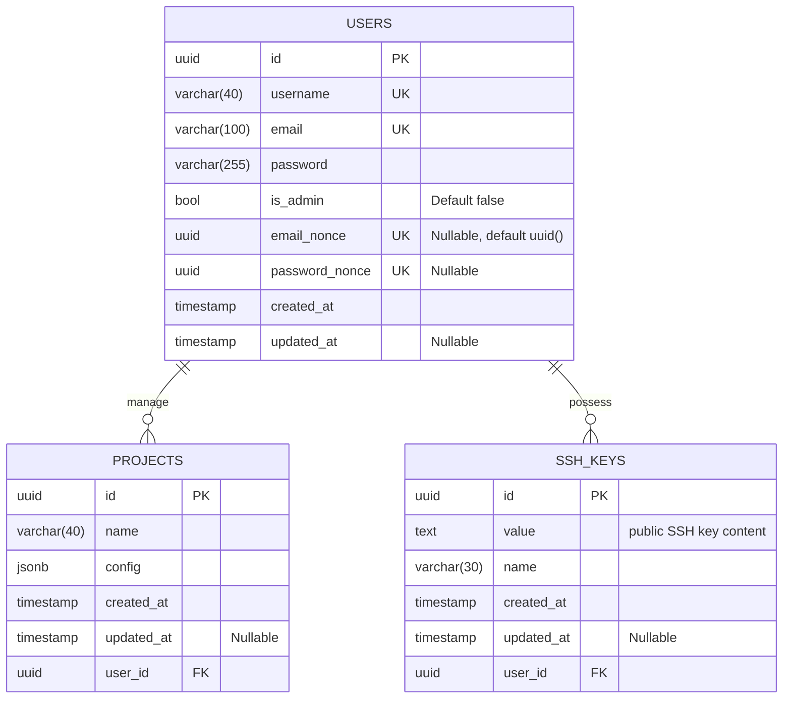

# PaaSTech - Technical Architecture Document

## Contextualisation

### Description and intent

***TODO: [UNIFIED WORK] write description of the software and its intent (what market needs it answers to)***

### Technologies

***TODO: [UNIFIED WORK] define the different technologies below, why they were chosen, and use arguments AND PROOFS to show research***

#### Web application

***TODO: [CLIENT] fill for web application frontend***

#### CLI (Command-Line Interface)

***TODO: [CLIENT] fill for the cli***

#### Client API

***TODO: [CLIENT] fill for the external API***

#### Git controller

***TODO: [GIT] fill for the git controller and architecture***

#### Client applications deployment

***TODO: [INFRA] fill for the architecture used to deploy clients' applications***

#### Database

The chosen database for this application is [PostgreSQL](https://www.postgresql.org/). As market leader, PostgreSQL stands out for its performance and widespread use throughout the world.

The API connects to the database using an ORM called [Prisma](https://www.prisma.io/).

#### CI/CD

***TODO: [UNIFIED WORK] describe use of Github Actions as means of CI/CD***

## Architecture

### Definitions

- the Service refers to PaaSTech as a whole;
- a Client (also referred to as a User) is a user account created by an end user against the Service;
- a Project is a materialisation of a Git repository, created by a Client using either the web frontend or the CLI. A Project can be deployed by the Client by pushing its code to the Service.
- an Application (also referred to as Deployment) is an atomic unit of code, and is the result of a Project deployment. This unit is internally managed and can only be configured to a certain extent by the Client.

### Component interaction

***TODO: [UNIFIED WORK] mermaid diagram of how components interact with eachother***

### Database architecture

As the database is unified and serves as a focal point of the application, everything is contained in the same logical database.
The architecture is as follows:

### Detailed specification

As you can notice, every table has a uuid field as a primary key. Compared to `SERIAL` that is often used to identify a table, a uuid guarantees a better uniqueness across the database. A [Serial](https://www.postgresql.org/docs/current/datatype-numeric.html) may take up less space (4 bytes) than an [uuid](https://www.postgresql.org/docs/current/datatype-uuid.html) (16 bytes) but since it is a series of incrementing integers it offers information about the time of creation and makes it easier to guess the id whereas an uuid is generated randomly and nearly impossible to duplicate.

Furthermore, since the projects will be deployed at a subdomain that is named after `https://{projectId}.user-app.paastech.cloud` we needed to hide the internal database structure that emerges with a serial id. Therefore, using a uuid prevents sharing sensitive data with everyone and prevents targeted attacks that will use.

The table `users` contains all the necessary information about each user. Upon user creation, an email_nonce is automatically created and a user account is only considered active once the email has been confirmed and the field email_nonce is null.
Should the user wish to reset his password, the field password_nounce will contain a unique uuid allowing the user to reset his password.
One user can have multiple projects or ssh keys.

The `ssh_keys` specified by each user allow them to push their repository onto our git server. Each ssh key can have a name to make it easier to distinguish multiple keys, however, it is not required.
A ssh key belongs to a user, so it will have the same permissions as the user on all his repositories at the moment.

The `projects` table describes a project. Its field `config` contains all the environmental variables of the user, like database authentication. since the configuration and necessary variables change for every project we decided to store it as a flexible json field. We decided to use a jsonb field that stores the json data in binary form, allowing for better performances than a simple json field. 

#### Key constraints

***TODO: [CLIENT, INFRA] the key constraints that should never be broken by the application (or at least the external parts, like the API and container exposition) in order to maintain security, isolation and client data safety***

#### Client sign-up and login process

***TODO: [CLIENT] mermaid diagram and description of the login process flow, for both the CLI and the web frontend***

#### Projects storage

***TODO: [GIT] how are the projects stored and how is authentication handled upon push***

#### Client Applications

***TODO: [INFRA] how are the Client applications provisioned, how they are exposed and how the underlying infrastructure is managed***

## Post-mortem

### Organisational overview

***TODO: [UNIFIED WORK] from an organisation standpoint, how was the entire team organised, how did the squads interact***
