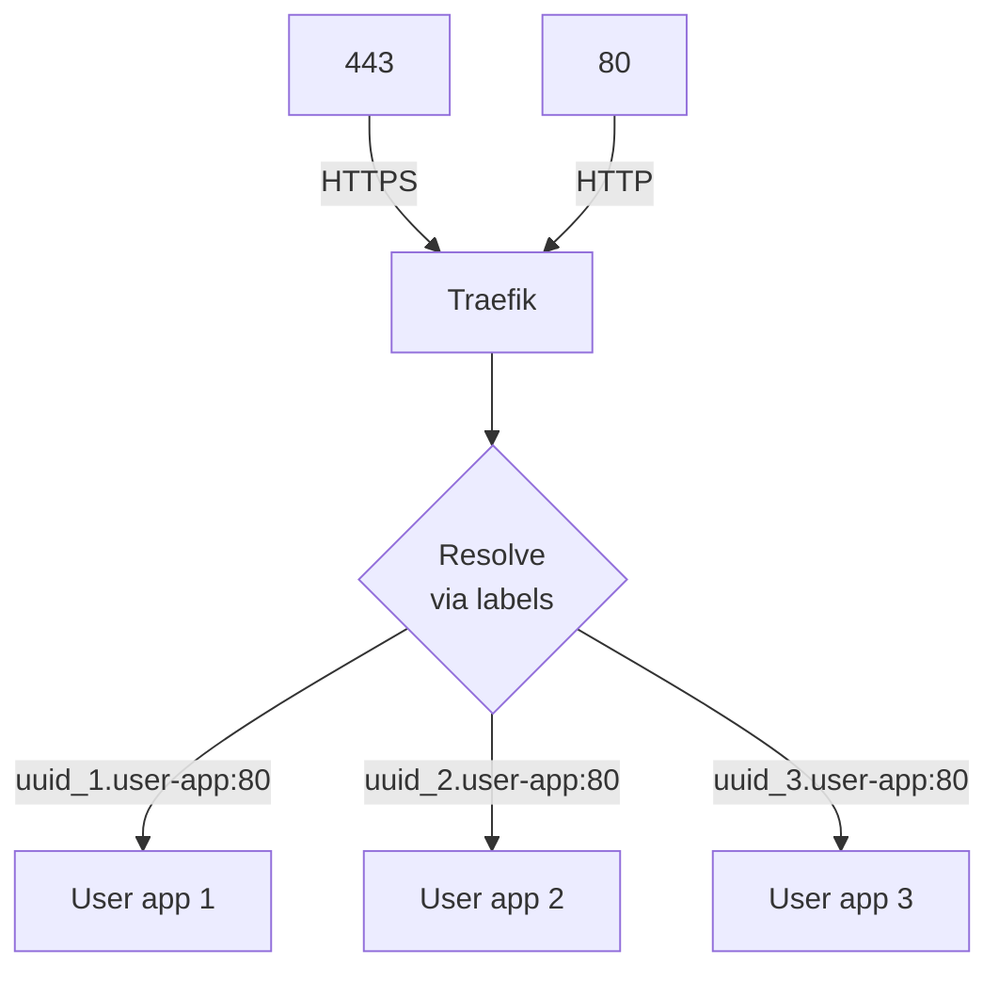

# PaaSTech - Technical Architecture Document

## Contextualisation

### Description and intent

***TODO: [UNIFIED WORK] write description of the software and its intent (what market needs it answers to)***

### Technologies

***TODO: [UNIFIED WORK] define the different technologies below, why they were chosen, and use arguments AND PROOFS to show research***

#### Web application

***TODO: [CLIENT] fill for web application frontend***

#### CLI (Command-Line Interface)

***TODO: [CLIENT] fill for the cli***

#### Client API

***TODO: [CLIENT] fill for the external API***

#### Git controller

***TODO: [GIT] fill for the git controller and architecture***

#### Client applications deployment

Pomegranate, the application and deployment manager, is in charge of monitoring and managing the containers' lifecycle, as well as configuring them.

[Rust](https://www.rust-lang.org/) was used to develop the service. We used this programming language because
we wanted a performant language that could be trusted with this job thanks to its compiler,
and with support for the other technologies we use.

Establishing communication with other services is done via [gRPC](https://grpc.io/docs/what-is-grpc/core-concepts/).
gRPC imposed itself as the go-to framework for internal APIs thanks to its [high performance](https://www.nexthink.com/blog/comparing-grpc-performance)

To handle containerized client applications. We chose [Docker](https://www.docker.com/) because we already
knew how to use it, and it is straightforward to communicate with the Docker server to manage containers.
It additionally provides us with easy networking and storage APIs, so we don't have to worry about those issues.
This choice helped us to quickly set up the MVP and get a working product as soon as possible.

Communication to the docker socket was achieved through the rust crate [Bollard](https://crates.io/crates/bollard/).
Bollard is quite a powerful crate that allows us to do everything we need for this iteration:

- Starting and stopping containers
- Managing images
- Fetching logs and stats

Once containers are spawned, they are exposed via [Traefik](https://traefik.io/traefik/).
It is used because it discovers when containers are started/stopped and can dynamically reconfigure itself to create and delete routes as those events happen.

#### Database

***TODO: [CLIENT] fill for the unified database schema***

#### CI/CD

***TODO: [UNIFIED WORK] describe use of Github Actions as means of CI/CD***


## Architecture

### Definitions

- the Service refers to PaaSTech as a whole;
- a Client is a user account created by an end user against the Service;
- a Project is a materialisation of a Git repository, created by a Client using either the web frontend or the CLI. A Project can be deployed by the Client by pushing its code to the Service.
- an Application (also referred to as Deployment) is an atomic unit of code, and is the result of a Project deployment. This unit is internally managed and can only be configured to a certain extent by the Client.


### Component interaction

***TODO: [UNIFIED WORK] mermaid diagram of how components interact with eachother***

```mermaid
flowchart LR

git<-.git over ssh.->client["CLI"]

git["Git server"]<--grpc-->api

client<--http-->api

api["API"]<--grpc-->pomegranate["Pomegranate"]

api<-->front["Web frontend"]

pomegranate<-.docker.sock.->docker(["Docker"])

api<--TCP/IP-->id1[(Database)]
```

### Database architecture

***TODO: [CLIENT] describe the database architecture, as referenced in the MCD in the README***

### Detailed specification

#### Key constraints

***TODO: [CLIENT, INFRA] the key constraints that should never be broken by the application (or at least the external parts, like the API and container exposition) in order to maintain security, isolation and client data safety***

#### Client sign-up and login process

***TODO: [CLIENT] mermaid diagram and description of the login process flow, for both the CLI and the web frontend***

#### Projects storage

***TODO: [GIT] how are the projects stored and how is authentication handled upon push***

#### Client Applications

Pomegranate, our application manager, is responsible for starting, stopping, and interacting with the client applications.
It is also responsible for managing the networking of the applications.

Pomegranate is completely stateless, and the API is the only external way to interact with it.
Once a container is started, Pomegranate does not keep track of it, and it is the responsibility of the execution engine to manage it.



To expose newly spawned containers to the World Wide Web, [Traefik](https://doc.traefik.io/traefik/) is configured to answer on 80 and 443 ports.
Then a set of labels is attributed to each container to create a unique subdomain `<app_uuid>.user-app.<fqdn>` redirecting to the port 80 of the associated app.

TLS Termination is handled by Traefik, by resolving the DNS-O1 challenge with the TLS provider of choice. This allows us to have a valid certificate for all subdomains of PaasTech.
In this case, the provider is Porkbun.

## Post-mortem

### Organisational overview

***TODO: [UNIFIED WORK] from an organisation standpoint, how was the entire team organised, how did the squads interact***

### Infrastructure

**Lessons learned:**

- Perhaps Rust was not the best language to interact with Docker since docker/kube has a first-party API in Golang. We had a lot of Rust specific issues during development that slowed down how productive we were.
- We defined poorly how our service should be interacted with, forcing us to adapt interfaces at the last minute.
- Docker is far from ideal to build a PaaS on. A more reliable and secure option would be to use Kubernetes, ideally with MicroVMs.
