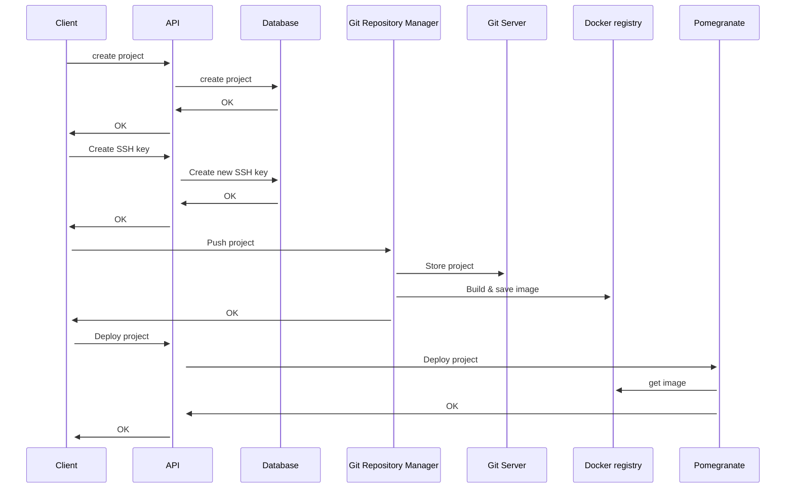

# PaaSTech - Technical Architecture Document

## Contextualisation

### Description and intent

**_TODO: [UNIFIED WORK] write description of the software and its intent (what market needs it answers to)_**

### Technologies

**_TODO: [UNIFIED WORK] define the different technologies below, why they were chosen, and use arguments AND PROOFS to show research_**

#### Web application

**_TODO: [CLIENT] fill for web application frontend_**

#### CLI (Command-Line Interface)

**_TODO: [CLIENT] fill for the cli_**

#### Client API

**_TODO: [CLIENT] fill for the external API_**

#### Git controller

**_TODO: [GIT] fill for the git controller and architecture_**

#### Client applications deployment

**_TODO: [INFRA] fill for the architecture used to deploy clients' applications_**

#### Database

**_TODO: [CLIENT] fill for the unified database schema_**

#### CI/CD

**_TODO: [UNIFIED WORK] describe use of Github Actions as means of CI/CD_**

## Architecture

### Definitions

- the Service refers to PaaSTech as a whole;
- a Client is a user account created by an end user against the Service;
- a Project is a materialisation of a Git repository, created by a Client using either the web frontend or the CLI. A Project can be deployed by the Client by pushing its code to the Service.
- an Application (also referred to as Deployment) is an atomic unit of code, and is the result of a Project deployment. This unit is internally managed and can only be configured to a certain extent by the Client.

### Component interaction

In this schema, we can see the different components interacting with each other. We decided, for this first iteration, to split services as much as we could to allow for a more modular architecture. This allows us to easily replace a component if needed, and to scale the different components independently.

- The client API is the main component that will be used by the clients to interact with the service. This API will then interact with the Git controller to create repositories and with Pomegranate to create Docker deployments, and with the database to store the data.
- The Git controller will interact with the host file system to create repositories, and with the local container registry to push images.
- Pomegranate, our deployment manager, will interact with the local container registry to pull images and with the host file system to create deployments.

Most of the interactions between the different components are done through gRPC, except for the web frontend and the CLI, which use HTTP requests. Using gRPC allows for a more efficient communication between the components, as well as a more secure one, as the communication is done through a private network. While the http requests allows us easier access to the API.

To understand their interactions better, wa can look at an example of a project deployment of a Client.

### Database architecture

**_TODO: [CLIENT] describe the database architecture, as referenced in the MCD in the README_**

### Detailed specification

#### Key constraints

**_TODO: [CLIENT, INFRA] the key constraints that should never be broken by the application (or at least the external parts, like the API and container exposition) in order to maintain security, isolation and client data safety_**

#### Client sign-up and login process

**_TODO: [CLIENT] mermaid diagram and description of the login process flow, for both the CLI and the web frontend_**

#### Projects storage

**_TODO: [GIT] how are the projects stored and how is authentication handled upon push_**

#### Client Applications

**_TODO: [INFRA] how are the Client applications provisioned, how they are exposed and how the underlying infrastructure is managed_**

## Post-mortem

### Organisational overview

**_TODO: [UNIFIED WORK] from an organisation standpoint, how was the entire team organised, how did the squads interact_**
