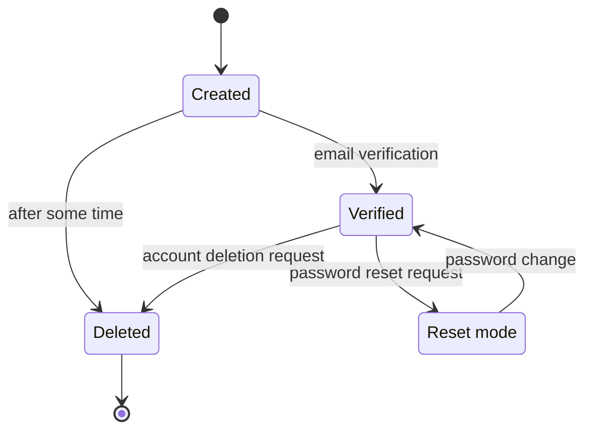
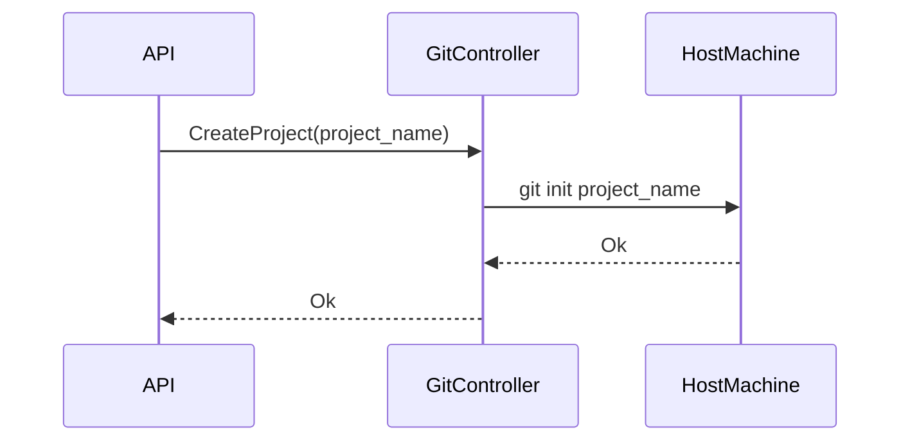
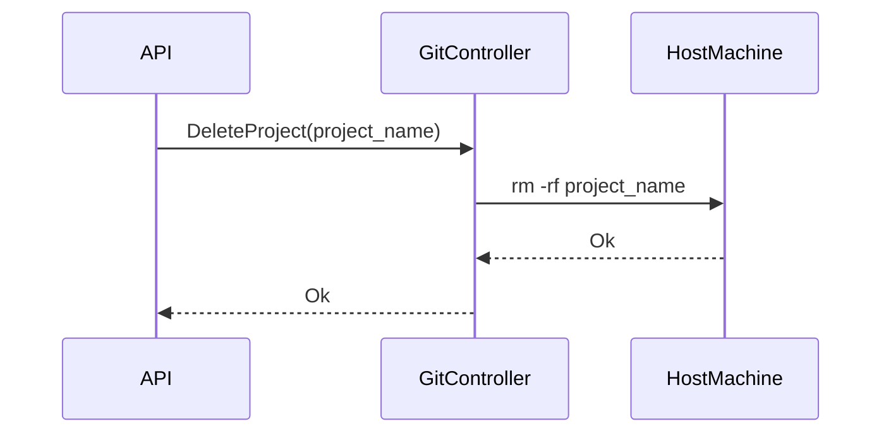
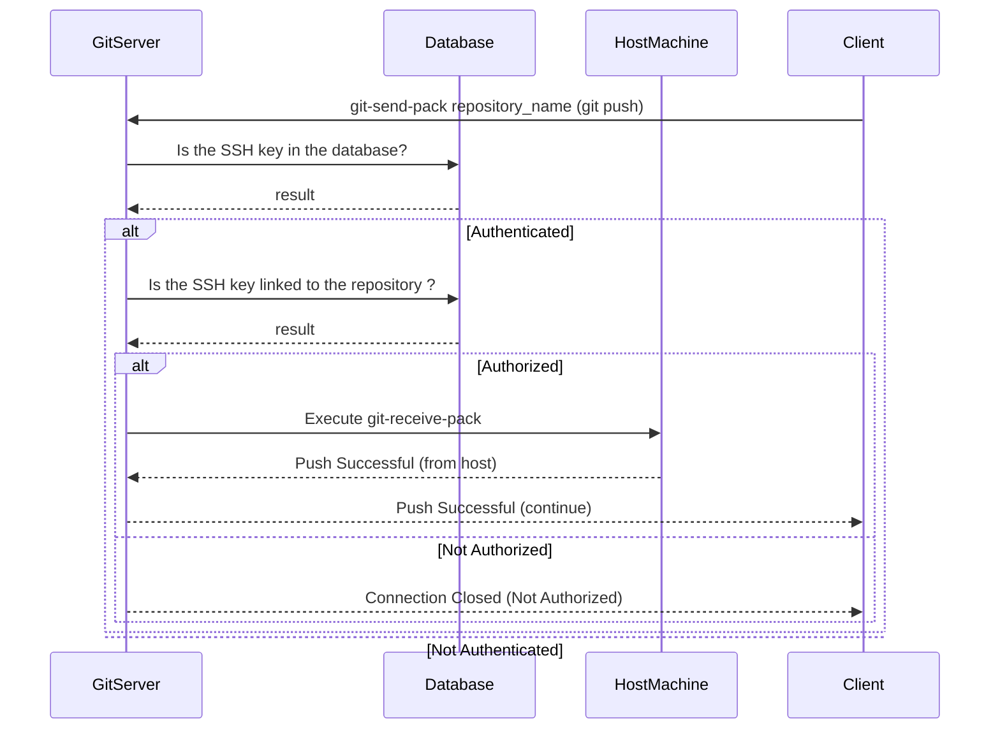

# PaaSTech - Technical Architecture Document

## Contextualisation

### Description and intent

**_TODO: [UNIFIED WORK] write description of the software and its intent (what market needs it answers to)_**

### Technologies

Below are the technologies used for the different components of the application. We will discuss the choices that we made, and why the chosen technology fits in the ecosystem.

A list of TPMs (Third-Party Modules) might be written to give more insight about the component, but please keep in mind those lists are non-exhaustive and only the main TPMs are described.

**_TODO: [UNIFIED WORK] define the different technologies below, why they were chosen, and use arguments AND PROOFS to show research_**

#### Web application

**_TODO: [CLIENT] fill for web application frontend_**

#### CLI (Command-Line Interface)

**_TODO: [CLIENT] fill for the cli_**

#### Client API


The Client API is one of the fundamental parts of our project. It not only handles all Client interactions, but is also the only application that can write any data in the shared database. It notifies [Pomegranate](#client-applications-deployment), the deployment manager, each time a project needs to be deployed and lets a user add their SSH keys to be able to connect to the local Git server. Every user request is send and verified by the API before being carried out.

With this API being such an important part of the project for the Client, the choice of language and frameworks was very important to allow for maximal performance. It is made using [TypeScript](https://www.typescriptlang.org/) with [NestJS](https://nestjs.com/).
Being a cutting-edge framework gaining more and more attention, NestJS is very versatile and stands
out from the competition by proposing two things:
1. A [list of support modules](https://www.npmjs.com/search?q=%40nestjs), which totals to 41 as of today;
2. An [extensive documentation with code examples](https://docs.nestjs.com/) ranging from basics to difficult recipes to setup.

NestJS' support modules provide a substantial support for the integration of well-known modules into the application. The main TPMs used for the API are:

- `class-validator`: validation of DTOs (Data Transfer Objects) and their properties before they are handed out to NestJS controllers
- `@nestjs/config`: ease of access to a config service, centralising both environment variables and `.env` files
- `passport` and `passport-jwt` (along with `@nestjs/passport` and `@nestjs/jwt`): layer of abstraction to handle different authentication methods, such as JWTs, OAuth2 or OIDC. Here, only the JWTs are used.
- `uuid`: generation of UUIDs v4, following [RFC 4122](https://www.rfc-editor.org/rfc/rfc4122)
- `nodemailer` with `handlebars`: sending of outbound emails through SMTP, with templating of HTML emails sent
- `@nestjs/swagger` with CLI plugin: generation of OpenAPI specification (used by the web interface to generate API-related code) and running Swagger UI to simplify testing

Moreover, all of the support that NestJS provides doesn't make it slower. Benchmarks open-sourced in v7.6.13 ([available here](https://github.com/nestjs/nest/blob/e7fa96022e8b8580413490101683aabe387ca9b9/benchmarks/all_output.txt)) gave the following comparison:

- NestJS-express is nearly on par with Express for the average response time (`65.44 ms` versus `61.88 ms`)
- NestJS-express is twice as fast in maximum response time (only `325 ms` against Express' `747 ms`)
- NestJS-express can handle nearly twice as many requests concurrently, for the minimum amount doable (`14183 req/s` versus `8407 req/s`)
- NestJS-express is on par with Express for the number of requests handled concurrently, for the average amount doable (`15640` versus `16454.41`)

The API is currently running on NestJS-express v10.0.3, which has just been released. Two years have passed since the last benchmarks, and we can expect NestJS to be even faster as of now.


##### Authentication strategies

Regarding the authentication strategy, our team decided to create a `GET /auth/login` endpoint which returns both a JWT HttpOnly cookie and a Bearer token.
The cookies keep users safe from XSS (Cross-Site Scripting) attacks and are used for authentication by the PaaSTech web interface, while the Bearer token allows users to log in via the CLI.

##### Mail

Since sending and receiving emails is an important part of user authentication and the password reset process, we needed a way to test these functions locally without needing to connect the application to a private email every time.
After some search we came across [MailHog](https://github.com/mailhog/MailHog). MailHog allows anyone to create a temporary local SMTP server to send and receive emails through.
Even though you are not able to send emails to real email addresses, you can send and receive emails locally, which is very helpful for code testing.

##### GRPC

To communicate with other services, especially Pomegranate and the git-repo-manager, we used [gRPC](https://grpc.io/), due to its high performance and low latency. It also allows us to easily create NestJS gRPC clients in order to communicate with the other services. Another great advantage of gRPC is that it is language agnostic, which means that we can use it to communicate with services written in other languages. Creating the `.proto` files allowed us to define contracts between the services which made it easier to develop the services independently.

##### SSH key

To be able to push their projects to the Git server, each user needs to associate at least one SSH key to their account. Using the command line, they will then be able to push their repositories' code to the server.

##### Administrators

In addition to the permissions of normal users, administrators have a few extra perks. 
Administrators are able to 
- view the non-critical information of each user (email, username)
- delete a user
- view all SSH keys
- view all existing projects

Since the SSH keys stored on our server are only the public part and therefore don't pose a security risk, there is no need to hide such information from administrators.
To avoid polluting the output if the administrator only wants to see their own SSH keys, we decided to separate both requests.
At the moment, it is neither possible to become an administrator through the website, nor to appoint someone to this role.

##### User Input Validation

One of the most important parts of an API is, to check the Client input values. Every piece of data provided by the User should follow the asked type and rules to assure the best performance and security and minimize the risk of errors occurring. To avoid checking each input individually, the verification is made using [Decorators](https://docs.nestjs.com/microservices/basics#decorators) and [Validators](https://docs.nestjs.com/pipes#class-validator) provided by NestJS. 
This way, the type and other necessary rules are automatically checked before even executing the code of the application and should the verification fail, the API will return a `BAD REQUEST` error.

##### Route protection

To protect each route from attacks, we secured each endpoint with [guards](https://docs.nestjs.com/guards). These classes define the rules to access different endpoints. To allow for the best user experience while keeping our application protected, three types of routes have been established:

- Public - accessible to everyone
- Private - only accessible to connected Clients
- Admin Only - only accessible to administrators

Each time a Client connects to the API to a protected endpoint, the guards automatically check if they have the necessary authorization before taking the actual request. 

##### Uniformity of response

In order to ease the communication with the other services, the API needed to return a uniform response. By using [Interceptors](https://docs.nestjs.com/interceptors), we were able to filter all outgoing data before it was sent to the Client. Every endpoint will return a json object containing a status as well as a message that contains the actual data to return.


#### Git controller

**_TODO: [GIT] fill for the git controller and architecture_**

#### Client applications deployment

Pomegranate, the application and deployment manager, is in charge of monitoring and managing the containers' lifecycle, as well as configuring them.

The [Rust](https://www.rust-lang.org/) programming language is used to develop the service.
We used it because we wanted an efficient and reliable language that could be trusted.
Thanks to its compiler, we are driven to write better code that handles errors and memory safety is guaranteed.

Furthermore, it supports the other technologies we use through the crates ecosystem.
Crates are third-party packages that provides additional features. They are managed by Cargo, which handles dependency resolution and versioning.

Establishing communication with other services is done via [gRPC](https://grpc.io/docs/what-is-grpc/core-concepts/).
gRPC imposed itself as the go-to framework for internal APIs thanks to its [high performance](https://www.nexthink.com/blog/comparing-grpc-performance) compared to [HTTP performance](https://github.com/programatik29/rust-web-benchmarks/blob/master/result/hello-world.md#comparisons).
Synthetic benchmarks shows that:
 - gRPC processes ~25% more requests compared to HTTP on a single core
 - gRPC scales better horizontally

To handle containerized client applications, we chose [Docker](https://www.docker.com/) because we already
knew how to use it, and it is straightforward to communicate with the Docker server to manage containers.
It additionally provides us with easy networking and storage APIs, so we don't have to worry about those issues.
This choice helped us to quickly set up the MVP (Minimum Viable Product) and get a working product as soon as possible.

Communication to the Docker socket was achieved through the [Bollard](https://crates.io/crates/bollard/) Rust crate.
Bollard is quite a powerful crate that allows us to do everything we need for this iteration:

- Starting and stopping containers
- Managing images
- Fetching logs and resource usage

Once containers are spawned, they are exposed via [Traefik](https://traefik.io/traefik/).
It is used because it discovers when containers are started/stopped and can dynamically reconfigure itself to create and delete routes as those events happen.

#### Database

The chosen database for this application is [PostgreSQL](https://www.postgresql.org/). As a market leader, PostgreSQL stands out for its performance and widespread use throughout the world.

The API connects to the database using an ORM called [Prisma](https://www.prisma.io/).

#### CI/CD

**_TODO: [UNIFIED WORK] describe use of Github Actions as means of CI/CD_**

## Architecture

### Definitions

- the Service refers to PaaSTech as a whole;
- a Client (also referred to as a User) is a user account created by an end user against the Service;
- a Project is a materialisation of a Git repository, created by a Client using either the web frontend or the CLI. A Project can be deployed by the Client by pushing its code to the Service.
- an Application (also referred to as Deployment) is an atomic unit of code, and is the result of a Project deployment. This unit is internally managed and can only be configured to a certain extent by the Client.

### Component interaction

**_TODO: [UNIFIED WORK] mermaid diagram of how components interact with eachother_**

### Database architecture

***TODO: [CLIENT] describe the database architecture, as referenced in the MCD in the README***

#### Key constraints

**_TODO: [CLIENT, INFRA] the key constraints that should never be broken by the application (or at least the external parts, like the API and container exposition) in order to maintain security, isolation and client data safety_**

#### Client sign-up and login process

##### Client states

When signing up, the client should provide an email address, a username and a password. They can then log into the software as soon as they verify their email. If needed, they can request a password reset using the "forgotten password" process. The account should be either deleted or locked/deactivated after some time of an account being active without a verified email, although this is not implemented for now.



##### Flow processes

#### Projects storage

As all PaaS providers, PaaSTech needs to store the code of the projects created by its Clients. This is done using a [Git](https://git-scm.com/) repository, which is created upon Project creation. The repository is then exposed to the Client, who can push their code to it.

We chose to use Git to store the code of the projects, because it is the most used version control system, and is the most adapted to store code. Using it makes the integration seamless for users who are probably already using Git.

##### Creating and deleting repositories

When a Client initializes a new Project, a new Git repository has to be created; it also has to be deleted when the Project itself is deleted.

The repository is created using the [`git init`](https://git-scm.com/docs/git-init) command. The repository is then stored in a directory, on the host machine, which is named after the **Project's id**.

For now, it is not scalable, as the git repositories are stored on the host machine. In future versions, the storage could be moved to a dedicated storage server or a distributed storage system.

In that sense, to prepare for future versions, the git controller is a **separated component** from the API which could have done the same and is also designed to be **stateless**. It does not store any information about the repositories and only uses the **Project's id** to name the repository's directory. This way, the git controller can be scaled horizontally, and, if needed, the repositories can be stored on a dedicated storage server after adding a layer of authorization.

Since the git controller is separated from the other components, it needs a way to communicate with the API. This was achieved using [gRPC](https://grpc.io/), which is a high performance RPC framework. It is used to create an interface other services can consume. The git controller can then receive commands from the rest of the services and execute shell commands to delete directories and git commands to initialize repositories.

We made the choice to use gRPC instead of a REST API. Indeed, since it uses [Protocol Buffers](https://developers.google.com/protocol-buffers), it is easier to maintain and to evolve as the application grows. It is also more performant than a REST API, and is easier to use, since it is strongly typed. It also limits communication problems between teams and services, since the communication is well-defined and documented through the Protocol Buffer file.

The Git Controller was made in Rust for its high performance, reliability, robustness and memory safety using the [tonic](https://github.com/hyperium/tonic) framework, which is a Rust implementation of gRPC. It was chosen because it is the most used gRPC framework in Rust, and is well documented.

Here's an overview of the interactions of the git controller:

1. Creation of a repository



2. Deletion of a repository



##### Authentication

Once the repositories are stored, the clients need to be able to push to them.

In order to let the users push to the repositories they created, we need to give them access to the host machine. An easy solution would be to give them an SSH access to the host machine with servers like [sshd](https://www.openssh.com/). However, this would give them access to the whole host machine, which is not what we want. Indeed, we want to limit the access of the clients to their own repositories, and not to the whole host machine.

One solution would be to use a git server like [Gitea](https://gitea.io/en-us/) or [GitLab](https://about.gitlab.com/), which provide a full-fledged git service, with authentication and authorization. However, this would require to maintain a full git server, with possibly duplicated data, which is not the goal of PaaSTech.

The option we chose is to create a custom git server, which handles the authentication and authorization of the clients, and then execute only the command `git-receive-pack` which is used to push to a repository. This way, the clients can only push to their own repositories, and not to the whole host machine.

The advantage of this solution is that it is lightweight and gives us full control over the authentication and authorization of the clients.

It also allows us to use the same authentication and authorization system as the rest of the Service, which is easier to maintain.

The git server is written in Golang, for its simplicity and its performance. It is also well documented, and has a lot of libraries to help us build the server, unlike Rust which was the original choice. The libraries used are [ssh made by Gliderlabs](https://github.com/gliderlabs/ssh) which is used to create git clients and servers. It is also used by [Gitea](https://about.gitea.com) to create their git server.

The authentication and authorization process is the following:

1. The client connects to the git server using SSH via `git push`
2. The git server checks if the client is authenticated using the SSH key provided by the client by matching it against the SSH keys stored in the database.
   1. If the client is not authenticated, the connection is closed
3. The git server checks if the client is authorized to push to the repository by checking if the client is the owner of the repository.
   1. If the client is not authorized, the connection is closed
4. The git server executes the command `git-receive-pack` which is used to push to a repository.



##### Building images

Once the code is finally pushed to the repository, it needs to be built in order to be deployed. Since the strategy we have chosen is [Docker](https://www.docker.com/), the code needs to be built into a docker image.

In that essence, since the client code can be written in any language, we need to be able to build the code in any language. To do so, we use [buildpacks](https://buildpacks.io/), which is a tool to build code in any language into a docker image. It is used by [Heroku](https://www.heroku.com/) to build their applications.

How can we trigger the build of the image? For a first version, we chose to use [git hooks](https://git-scm.com/book/en/v2/Customizing-Git-Git-Hooks) to trigger a bash script which will build the image on the host machine.

This is not scalable, as the build is done on the host machine.

It also poses questions about security risks since our SSH server needs to be able to access the docker daemon on the host machine. But it is a good first step to test the concept.

Some builders might not be able to build the code without configuration, hence, we need to be able to configure the buildpacks. To do so, the client can store a file called `buildpacks.yaml` in the `paastech` directory which will allow the user to configure the buildpacks. The file is a yaml file, which contains the configuration of the buildpacks. It is then used by the git hook to configure buildpacks. Here's the structure of the file:

```yaml
buildpacks:
  path: "."
  builder: "paketobuildpacks/builder:full"
  buildpack: "paketo-buildpacks/web-servers"
  env:
    - "BP_WEB_SERVER=nginx"
    - "BP_WEB_SERVER_ROOT=dist"
```

- `path` is the path to the directory containing the code to build
- `builder` is the builder to use to build the code
- `buildpack` is the buildpack to use to build the code
- `env` is the environment variables to pass to the buildpack

The buildpacks are then configured using the `pack` cli, which is the cli of buildpacks. The script is made in bash for its simplicity and its portability. It is also well documented, and has a lot of libraries to help us build the script.


#### Client Applications

Pomegranate is responsible for starting, stopping, and interacting with the client applications.
It is also responsible for managing the networking of the applications.

Pomegranate is completely stateless, and the API is the only external way to interact with it.
Once a container is started, Pomegranate does not keep track of it, and it is the responsibility of the execution engine to manage it.


To expose newly spawned containers to the World Wide Web, [Traefik](https://doc.traefik.io/traefik/) is configured to listen to the 80 and 443 ports.
Then a set of labels is attributed to each container to create a unique subdomain `<app_uuid>.user-app.<fqdn>` redirecting to the port 80 of the associated app.

Pomegranate receives a domain name as an environment variable. 
Doing so enables flexibility during the development and deployment process, as the developer can easily swap between a localhost environment (`<uuid>.user-app.localhost`) and a production environment (`<uuid>.user-app.paastech.cloud`).

TLS termination is handled by Traefik. It manages resolving the DNS-01 challenge with the configured certificate authority. This allows us to have a valid certificate for all subdomains of PaaSTech.
In this case, our DNS registrar is Porkbun, and our certificate authority is Let's Encrypt.

## Post-mortem

### Organisational overview

### API

This project introduced most members of the team to NestJS. Due to its well written documentation it was easily picked up and with the various modules it allows for good performance and automized a lot during development.

However, we had some problems concerning the API as a whole. In the beginning, the API was meant to only manage the users. A centralized controller should have managed the communication between the API, Pomegranate and the git server. However, as more and more time passed, the controller was completely erased and the API dealt with most of its responsibilities. This led to an important increase of the workload, especially since it already had some delay in the early stages of the development due to miscommunication.


### Infrastructure

**Lessons learned:**

- Rust might not have been the best language to interact with Docker since Docker/Kubernetes has a first-party API in Go. We had a lot of Rust specific issues during development that slowed down how productive we were.
- We defined poorly how our service should be interacted with, forcing us to adapt interfaces at the last minute.
- Docker is far from ideal to build a PaaS on. A more reliable and secure option would be to use Kubernetes, ideally with microVMs.
