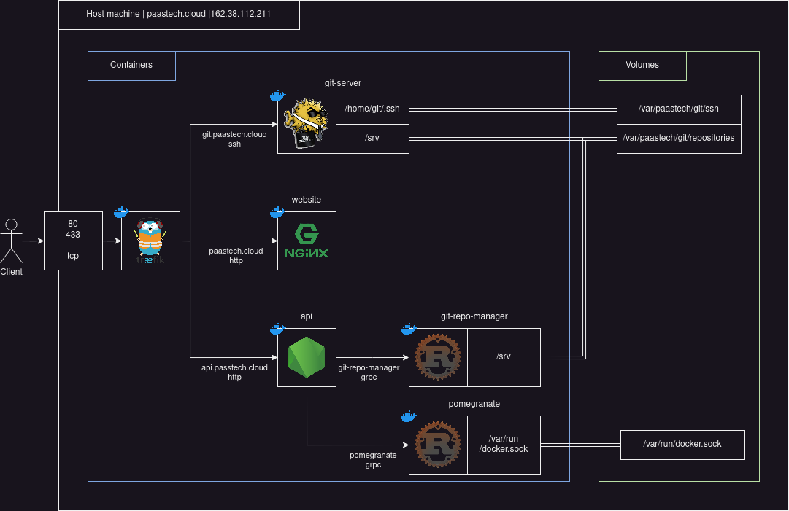
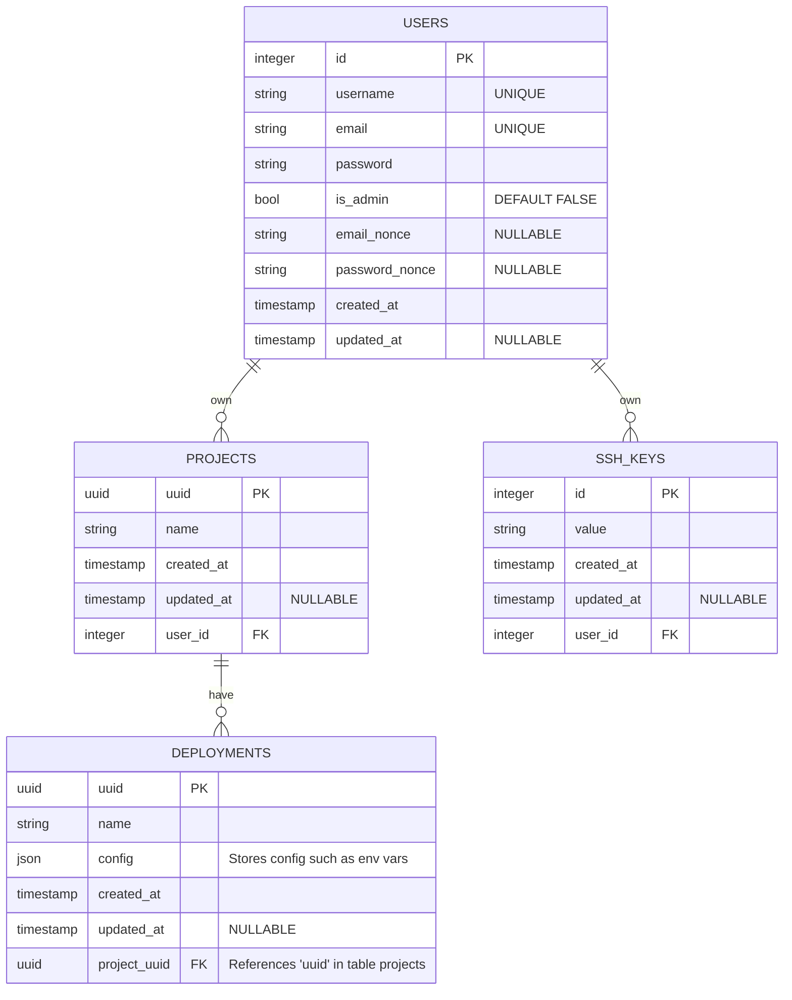

# PaaSTech Cloud

In today's digital landscape, organizations are increasingly relying on cloud computing platforms to streamline their operations and deliver innovative applications and services to their customers. Platform as a Service (PaaS) solutions have emerged as a key enabler for developers, allowing them to focus on building and deploying applications without the hassle of managing underlying infrastructure.

With our open source PaaS solution, we are enabling developers and organizations to freely install and use our platform on their machines. This approach eliminates any dependency on specific vendors or proprietary systems, giving users the freedom to tailor the solution to their unique requirements and infrastructure preferences.

This open source solution, unlike others such as [Dokku](https://dokku.com/), aims to offer a comprehensive web console with both access for users and administrators of the platform and better isolation between client applications.

## Services

For simplicity's sake, the platform is hosted on a single machine using docker compose to simplify containers orchestration and reproductibility.

Ports 80 and 433 are exposed on the machine to serve as a reverse proxy and a load balanced for web traffic.

It handles SSL certification management and termination as well as HTTPS traffic and HTTP to HTTPS redirections.

The services exposed to the web are :

- the `api` handles access to the database
- the `git-server` handles ssh connections
- the `website` serves web pages

Internal services are :

- the `database` which holds all the data relevant to the platform
- the `git-repo-manager` creates and deletes repositories
- `pomegranate` starts client apps in containers and manages networking

### API

// TODO

### The website

// TODO

### The git server

As all PaaS, PaaSTech requires the client code to build and run their apps. The chosen strategy to accomplish that transfer of code is git. Git's ecosystem is very developed and developpers are familiar with the way it works. It's also [optimized for storing text data](https://git-scm.com/book/en/v2/Git-Internals-Packfiles) and simplifies versioning and is secure since it is over ssh. It also is a great way to collaborate.

The git server's role is to accept ssh connections and route the clients requests to the adequate git repository. It also serves as an authentication layer, checking if the user connecting has rights over the repository he is trying to access, and only accepting `git push`.

### The Database

The database stores client information such as credentials, deployments, configurations, ssh keys, etc.

The RDBMS chosen is PostgreSQL for its robustness, features and acid compliance.

#### Data model

The `users` table represent the users of the platform. It includes the necessary data for email validation.

The `projects` table represent namespaces in which the client's applications are deployed. It's `uuid` is also the name of the repository the project is linked to.

The `deployments` table represents the deployments detected in the project. If it is a monorepo, there might be multiple deployments in a project.

The `ssh_keys` table stores the users ssh_keys for access to his repositories via the `git-server`.

### The git repo manager

The git repo manager is a gRPC server which allows the API to manage git repositories. It also adds the [post-receive](https://git-scm.com/docs/githooks) hook, which holds the logic to build the client application after a push.

### Pomegranate

// TODO
