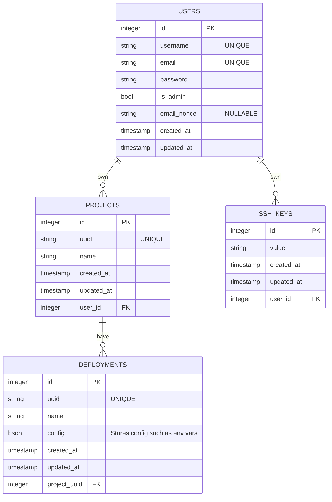

# PaaSTech Cloud

## MCD

```mermaid
erDiagram
    USERS ||--o{ PROJECTS : own
    USERS ||--o{ SSH_KEYS : own
    PROJECTS ||--o{ DEPLOYMENTS : have
    USERS {
        integer id PK
        string username "UNIQUE"
        string email "UNIQUE"
        string password
        bool is_admin
        string email_nonce "NULLABLE"
        timestamp created_at
        timestamp updated_at
    }
    SSH_KEYS {
        integer id PK
        string value
        timestamp created_at
        timestamp updated_at
        integer user_id FK
    }
    PROJECTS {
        integer id PK
        string uuid "UNIQUE"
        string name
        timestamp created_at
        timestamp updated_at
        integer user_id FK
    }
    DEPLOYMENTS {
        integer id PK
        string uuid "UNIQUE"
        string name
        bson config "Stores config such as env vars"
        timestamp created_at
        timestamp updated_at
        integer project_uuid FK
    }
```
